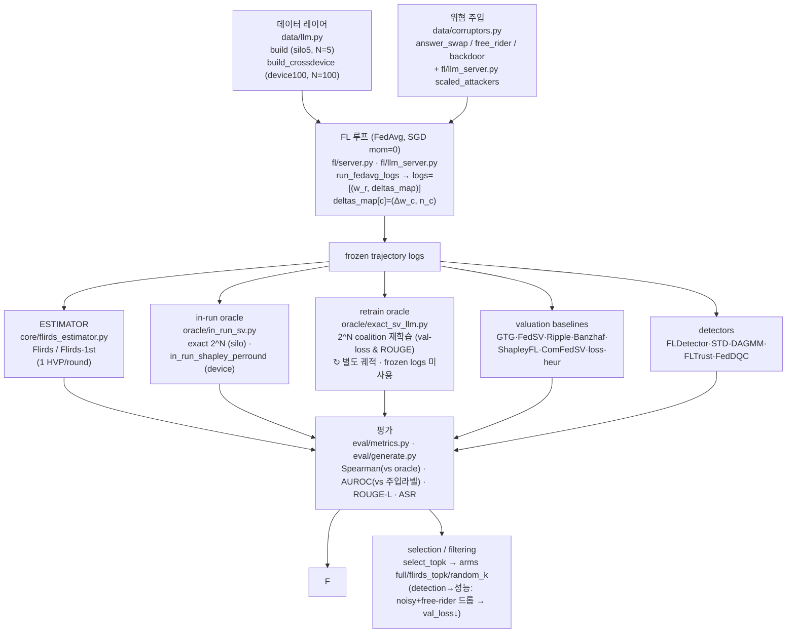

# 00 · 전체 그림 한 장

> 이 폴더는 **외부 발표용이 아니라 연구자(Yonghee) 본인이 전체 그림을 다시 잡기 위한 체크포인트**다.
> 모든 주장은 실제 코드(`codes/`), raw 로그(`research-wiki/raw/`), 논문 PDF를 직접 읽어 grounding했다.
> **3-state 규율**을 전 문서에 적용: ⓐ = 코드 구현 + smoke green(값은 coarse) / ⓑ = 실제 실험결과 확보(seed·N·model 명시) / ⓒ = 설계 락됐으나 미실행.

---

## 0.1 한 줄 정의

**Flirds** = client-level **F**ederated **L**earning **I**n-**R**un **D**ata **S**hapley. FedAvg 학습 궤적(trajectory)을 얼린 뒤, **server-side validation loss의 1차+2차 Taylor 전개**로 각 client의 in-run Shapley value $\phi_k$ 를 round당 HVP **1회**로 추정한다. 재학습(retraining) 없음, 추가 통신 0.

핵심 수식 (`codes/flirds/core/flirds_estimator.py:13`):

$$
\phi_k = \sum_r p_k^r [ \langle g^r, \Delta w_k\rangle + \tfrac12 \langle \Delta w_k, u^r\rangle ], \quad u^r = H^r \Delta W^r
$$

- $g^r$ = ∇ val-loss at $w^r$, $H^r$ = **true Hessian** (IRDS와 동일; GGN/Fisher는 테스트 후 기각)
- $\Delta W^r$ = $\sum_{j\in P_r}$ $p_j^r$ $\Delta w_j$ (round aggregate), $p_k^r = n_k / \sum_{j\in P_r} n_j$ (FedAvg participant weight)
- sign: client가 val-loss를 **내리면 $\phi_k$ < 0** (= 더 가치있음)
- `second_order=False` → 1차만 = **Flirds-1st** (≈15× 더 쌈)

---

## 0.2 End-to-end 파이프라인

데이터 흐름의 불변식(durable):
- 모든 컴포넌트는 `logs = [(w_r, deltas_map)]` 만 본다 (backend-agnostic). estimator/oracle는 model·val·task를 **직접 보지 않고** `loss_fn(params, buffers)` + `pkeys` 주입으로만 동작 (`codes/flirds/core/flirds_estimator.py:6-8`).
- backend는 `backends/{cnn,llm}.py` 의 `make_*_loss` 가 담당 → CNN/LLM 동일 인터페이스.

---

## 0.3 구성요소 지도

### Estimator (우리 방법) — 2종
| 이름 | 코드 | 설명 | 상태 |
|---|---|---|---|
| **Flirds** | `core/flirds_estimator.py` `second_order=True` | 1차+2차 Taylor, round당 HVP 1회 | ⓑ (1B N5 3-seed) |
| **Flirds-1st** | 같은 함수 `second_order=False` | 1차만 (= IRDS-1st self-ablation; FLTrust cosine과 사실상 동일 신호) | ⓑ (1B N5 3-seed) |

### Oracle (ground truth) — 2종 (절대 평균내지 않고 별도 보고; 코드 공유 금지 — `flirds-protocol.md:84-86`)
| 이름 | 코드 | utility | 비용 | 상태 |
|---|---|---|---|---|
| **in-run oracle** | `oracle/in_run_sv.py` | frozen trajectory에서 coalition별 val-loss 변화의 exact $2^N$ Shapley (재학습 X) | $2^N$·R·val·seq (FLOP-bound) | ⓑ (silo5 N5; device100 N100 1-seed) |
| **retrain oracle** | `oracle/exact_sv_llm.py` | coalition S로 FedAvg **재학습** → 배포모델 점수 (val-loss & ROUGE) | N5=126min(1B fp32) | ⓑ (1B N5; 3B N5 1-seed) |

> **retrain oracle vs in-run oracle 핵심**: 둘은 **다른 게임**. in-run oracle=궤적-앵커 in-run(우리 방법이 근사하는 대상), retrain oracle=재학습(고전 Data Shapley). 방법 검증은 **retrain val-loss = in-run oracle = estimator** 가 같은 게임이라 +1.000으로 일치(ⓑ). retrain ROUGE는 다른 게임이라 발산(+0.4@1B) — 미분불가라 estimator-ROUGE도 불가능 → **검증엔 반드시 val-loss**.

### Valuation baselines (성능비교 경쟁) — 7종
GTG-Shapley · FedSV · Ripple · Data Banzhaf · ShapleyFL · ComFedSV · loss-heuristic. 코드: `codes/flirds/baselines/`. 모두 같은 frozen trajectory 위에서 돈다(공정비교). 상세·PDF대조 → [03-baselines-and-prior-work](03-baselines-and-prior-work.md).

### Detectors (검출 경쟁 bar) — 4종 (위협-매칭, threat-matched)
| detector | 코드 | 타깃 위협 | 모델 필요? | 상태 |
|---|---|---|---|---|
| **FLDetector** | `baselines/fldetector.py` | poisoning (시간 일관성) | model-free | ⓑ |
| **STD-DAGMM** | `baselines/std_dagmm.py` | free-rider (독립 baseline) | model-free | ⓑ (N100 1-seed) |
| **FLTrust** | `baselines/fltrust.py` | free-rider+poison (val-grad cosine = Flirds-1st와 동일신호) | val-grad 필요 | ⓑ (N100 1-seed) |
| **FedDQC** | `baselines/feddqc.py` | noisy/data-quality (IRA) | client 데이터+model 필요 | ⓑ (1-seed smoke) |

### 9-method 합계
"valuation method 9종" = Flirds, Flirds-1st, GTG, FedSV, Banzhaf, ShapleyFL, loss-heur, (그리고 regime별) Banzhaf/ComFedSV, + in-run oracle. `phase1_baseline_compare.py` 가 silo5에서 9-method를 한 궤적 위에서 비교(Ripple은 RIPPLE=0로 분리; eigsh flaky).

### 2 regime × 4 threat 매트릭스
| | **noisy** (answer_swap) | **freerider_zero** | **freerider_random** | **poison** (backdoor) |
|---|---|---|---|---|
| **silo5** (N=5, full participation, 1 domain/client) | ✓ | ✓ | ✓ | ✓ (working-backdoor config) |
| **device100** (N=100, Dirichlet-α partial, domain-mix) | ✓ | ✓ | ✓ | ✓ (per_client=300) |

오케스트레이터: `codes/experiments/phase2_matrix.py` — env-parameterized [REGIME × THREAT × ALPHA × SEED], regime별 method-set 게이팅 + 4 detector 매 threat. 상세 → [02-experimental-setup](02-experimental-setup.md).

---

## 0.4 핵심 용어집

| 용어 | 뜻 |
|---|---|
| **Flirds / Flirds-1st** | 우리 estimator(1차+2차 / 1차만). `core/flirds_estimator.py` |
| **retrain oracle** | 재학습 기반 exact Shapley (Ghorbani-Zou 계열). coalition마다 FedAvg 재학습. `oracle/exact_sv_llm.py` |
| **in-run oracle** | in-run exact $2^N$ Shapley. frozen trajectory에서 coalition별 val-loss 변화 합. 재학습 X. `oracle/in_run_sv.py` |
| **in-run** | "한 번의 학습 궤적 안에서" 값을 매김 (재학습 없이). IRDS(In-Run Data Shapley)에서 차용한 핵심 idea |
| **ComFedSV** | FedSV + low-rank matrix completion (partial participation 보정). device100 전용 baseline. `baselines/comfedsv.py` |
| **backdoor install / propagation / detection tests** | backdoor 단계 진단 smoke. install test=no-FL install isolation / propagation test=FL model-replacement 전파 / detection test=working backdoor에 detector 반응. `phase2_backdoor_*_smoke.py` |
| **threat matrix** | plan의 "검출 baseline + 위협 매트릭스" 섹션(`flirds-implementation-plan.md:312`). poison-vs-Flirds framing 논쟁의 진원지 |
| **silo5 / device100** | cross-silo N=5(full participation, 도메인당 1 client) / cross-device N=100(Dirichlet-α partial participation, per-client 도메인 혼합) |
| **answer_swap** | noisy 위협 = client 내부에서 completion을 셔플 → 정직하지만 나쁜 데이터(data-quality). `corruptors.py:28` |
| **free_rider (zero/random)** | 가짜 update(0 또는 benign-std 매칭 random). Lin 2019 taxonomy. `corruptors.py:70` |
| **backdoor** | Xu 2023 instruction-trigger("tq")→target + Bagdasaryan γ-scaled model-replacement. `corruptors.py:47` + `llm_server.py:57` |
| **poison_frac** | backdoor에서 poison되는 sample 비율 = **clean-preservation knob**. 0.5–0.8=clean 보존+install, 1.0=clean 파괴 |
| **working-backdoor config** | backdoor가 전파되는 설정: `LR=2e-3 BATCH=8 EPOCHS=5 POISON_FRAC=0.8` (matrix 기본 lr1e-3/batch16은 ASR=0) |
| **proxy-truth** | device100 off-anchor에서 in-run oracle이 너무 비싸 못 돌릴 때 Flirds를 검증된 대리 진실로 사용 |
| **HVP** | Hessian-vector product. forward-over-reverse(`jvp∘grad`), **H·v** (forward; H⁻¹ 절대 안 씀) → eager attention 필수 |

---

## 0.5 한 페이지 상태표 (3-state)

> **요지: 코드와 phase1(silo5 N5) 결과는 단단하다. real grid(매트릭스 전체)는 아직 한 번도 안 돌았다.** `runs/phase2_matrix/`는 빈 폴더(0 files); matrix는 stdout/`/tmp`에만 출력. (`phase2_matrix.py:122`, find 결과)

| 항목 | 상태 | 근거 |
|---|---|---|
| Estimator + retrain/in-run oracle + LLM backend + FL 루프 + 5-domain 데이터 | **구현완료** | `codes/flirds/` 전체; smoke green |
| **Phase1 1B N=5 cross-silo, 3-seed (lr 1e-3 & 3e-3)** — 9-method Spearman, AUROC, selection run | **ⓑ 실제결과** | `codes/runs/full_lr{1e-3,3e-3}/flirds-1b-N5-seed{0,1,2}/metrics.json` |
| retrain-oracle validation, 1B N=5 (fp32): retrain val-loss=in-run oracle=estimator +1.000 | **ⓑ 실제결과** | `raw/.../2026-06-07-phase2-task6-a-retrain-oracle.md` |
| retrain-oracle validation 3B N=5 retrain val-loss vs in-run oracle +0.900, estimator +1.000 | **ⓑ 1-seed** | `raw/.../2026-06-08-phase2-task7-crossdevice-detection-redesign.md` |
| cross-device port, N=100 α=0.5: Flirds vs per-round in-run oracle +1.000; oracle 771ms/fwd | **ⓑ 1-seed smoke** | `raw/.../2026-06-08-...redesign.md` |
| detector-suite build, N=100: STD-DAGMM FR 0.628 / FLTrust FR 1.0 | **ⓑ 1-seed** | `raw/.../2026-06-08-phase2-task7e-detector-suite-steps1-3.md` |
| backdoor install/propagation/detection 특성화 (install·전파·검출) | **ⓑ 1-seed smoke** | `raw/.../2026-06-09-phase2-task7e-backdoor-install-feddqc.md` |
| matrix-orchestrator build + scale-up 코드 | **ⓐ 구현+smoke** | `phase2_matrix.py`; 5 code paths green (tiny config) |
| device100 poison 해결 (per_client 40→300, ASR 0→0.75) | **ⓑ 1-seed 탐색** | `raw/.../2026-06-09-phase2-step5-matrix-orchestrator-task8.md` |
| **real grid (silo5 N5 → device100 α-sweep → 3B → 7B, 3-seed 전체)** | **ⓒ 미실행** | `runs/phase2_matrix/` 빈 폴더 |
| N=10 retrain oracle (LLM) | **ⓒ 연기** | 비용 2–5일/1-GPU → multi-GPU sharding 필요 |
| 7B in-run oracle | **ⓒ 미실행** | matrix MODEL_CFG 경로에 있으나 미실행 |

> **문서 과장 교정(검증값 채택)**: ① poison detector STD-DAGMM·FLTrust = **0.75**(1.0 아님) ② "all methods +1.000"의 FedSV는 tiny-config서 **+0.900** (단 phase1 real은 +1.000) ③ STD-DAGMM runtime ~**360s**(~100s 아님) ④ backdoor detection test "evades-Flirds REFUTED" → matrix가 맞음: 표준 orientation서 **Flirds AUROC=0.0(EVADED)**. 상세 → [05-open-issues-and-next](05-open-issues-and-next.md). 근거: `memory/phase2-step5-verification.md`.

---

## 0.6 추천 읽기 순서

1. **이 문서(00)** — 전체 지도
2. [01-research-value](01-research-value.md) — 알고리즘이 코드상 정확히 어떻게 도는가 + 노벨티
3. [02-experimental-setup](02-experimental-setup.md) — 최종 실험 세팅(모델/regime/threat/하이퍼)
4. [03-baselines-and-prior-work](03-baselines-and-prior-work.md) — baseline + 선행연구(PDF 1:1 대조) *(가장 무거움)*
5. [04-plan-vs-implementation-divergences](04-plan-vs-implementation-divergences.md) — plan 대비 달라진 점 11건
6. [05-open-issues-and-next](05-open-issues-and-next.md) — 미해결 + 다음 단계(real grid)
